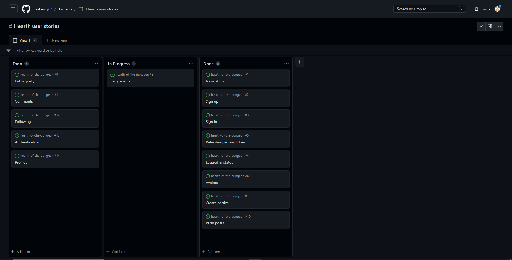
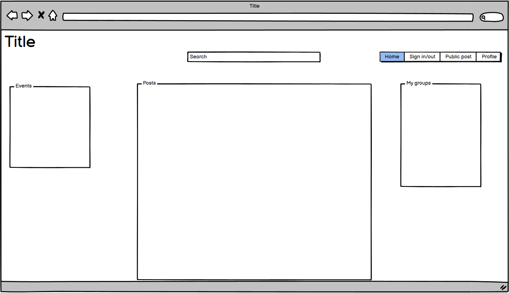
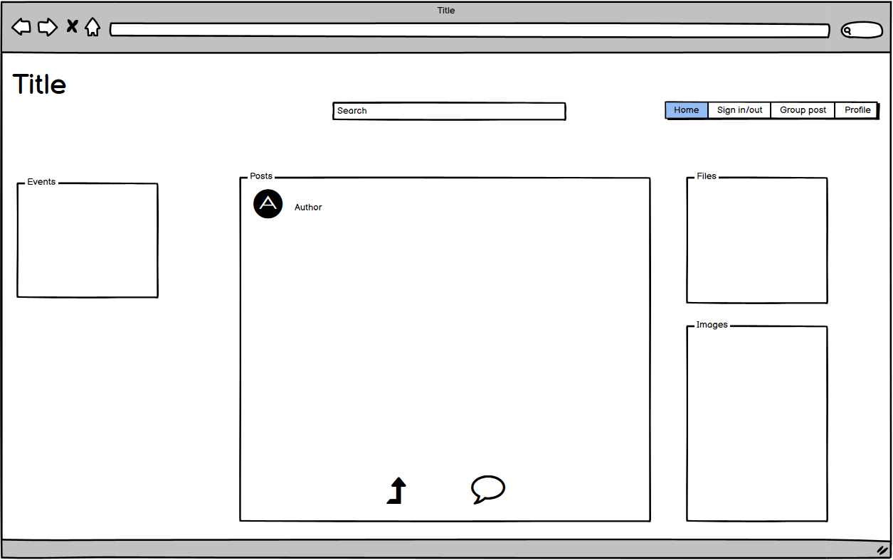
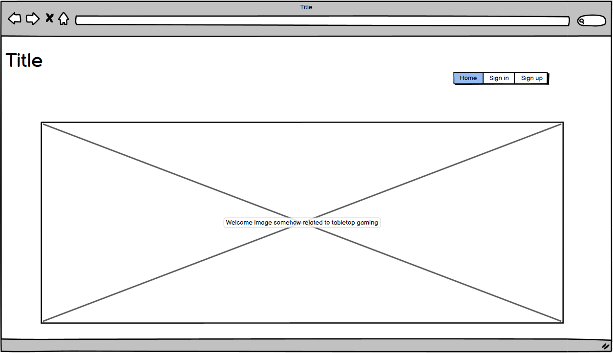

# The Hearth of the Dungeon API

Tabletop games, while always popular, have greatly increased in popularity over the last several years. This is also true of tabeltop role-playing games, such as Dungeons & Dragons, Pathfinder, and a host of others. Libraries, bookstores, cafés, and sometimes bars host game nights, while families and groups of friends will meet wherever they can to play. During the COVID-19 pandemic, people turned to playing their games online using virtual tabletops. The purpose of this site is to enable people to find new groups to play with and for those already in groups to be able to engage in discussion regarding their games. Groups can be created by users and can then be followed. Users can post images and conversation topics to these groups, with commenting and liking available. A group owner can also post event notifications to their group.
Live demo [_here_](https://notandy82-hearth-of-the-dungeon.herokuapp.com/)

## Table of Contents
* [User Experience (UX)](#user-experience)
  * [User Stories](#user-stories)
  * [Existing Features](#existing-features)
  * [Features to Implement](#features-to-implement)
* [Technologies Used](#technologies-used)
* [Development](#development)
* [Testing](#testing)
* [Deployment](#deployment)
  * [GitHub](#github)
  * [Heroku](#heroku)
* [Credits](#credits)
* [Contact](#contact)

## User Experience (UX)

### User Stories
- Site owner
  - As a site owner i would like to redirect users that are not authenticated directly to the log in page so that I can maintain the privacy of users on the site.

- Site user 
  - As a user I can view a navbar on every page to easily navigate the site.
  - As a new user I can create an account so that I can access all features for users.
  - As a user I can sign in to the app to access all functionality for users.
  - As a user I can see if I am logged in and have appropriate navigation options.
  - As a user I can maintain my logged in status so that I can have access to the site's functions for as long as I choose.
  - As a user, I can see other users' avatars so I can easily distinguish one user from another.
  - As a logged in user I can create a party to create a discussion space for a group.
  - As a user I can create a calendar post so that other users in a party can be alerted to evens for my party.
  - As a user I can create a public post so that other users can find my party.
  - As a user I can make posts in my party so that I can create a discussion within the group.
  - As a user I can comment on a user's post so that I can share my thoughts about a post.
  - As a user I can follow a party so that I can see all posts make in the party.
  - As a user I can see a profile page for users so I can see a user's basic information.

### Existing Features

- Profiles
  - Users are able to sign up to view the site. They can include their name, an image, and a short description of themselves.

- Sign in
  - Users who have signed up can sign in to the site to gain access to all functionality.

- Navigation
  - Users who are signed in have a navigation bar on each page with user appropriate links

- Parties
  - Users are able to create a party with a name, description, location, and image. Within the party, users are able to create image and text posts.

- Posts
  - Users can post images or discussion to parties.

### Features to Implement

- Comments
  - Users can post comments on other users' posts

- Likes
  - Users can 'like' another user's post. The number of likes on each post is displayed on the post.

- Following
  - Users are able to follow parties. This will result in any posts and dates made for that party to display in their feed.

- Dates
  - A party owner can create events so that followers will know when the party is having a game night.

## Technologies Used

### Languages

- Reactjs

### Libraries and Programs
- GitPod for building and editing code
- GitHub for storing code and deploying site
- Git for version control
- Balsamiq for initial development
- Heroku for project deployment
- ElephantSQL for database management
- Cloudinary for image hosting
- React Bootstrap for styling
- Google fonts for fonts
- Font awesome for icons
- Favicon.cc for favicon

## Development
- User stories were established to determine the direction of development.

- The site was planned using Balsamiq wireframes.
  - Homepage view

  - Party page view

  - Log in/Sign up view

## Testing

- Functionality was manually tested throughout development.

## Deployment
The site was deployed through GitHub and Heroku

### Github
 - The repository was created as follows:
   - Log in to GitHub
   - Click new repository
   - Fill in a repository name
   - Click the greeen Gitpod button to create a new workspace
   - To create the react app, in the terminal, use the command 'npx create-react-app . --template git+https://github.com/Code-Institute-Org/cra-template-moments.git --use-npm'
   - To view a preview of the site, in the terminal, use the command 'npm start'

### Heroku
 - The process of setting up Django and deploying to Heroku was done by 

## Credits

### Content
- Log in/Sign up page image by Stéphane Juban on unsplash
- Upload and not found images from Code Institute walkthrough project
  
- Thanks
  - Thanks to my family for their support and patience
  - Thanks to my mentor Adegbenga Adeye for his guidance

## Contact
Created by Andrew Stanek (notandystanek@gmail.com)